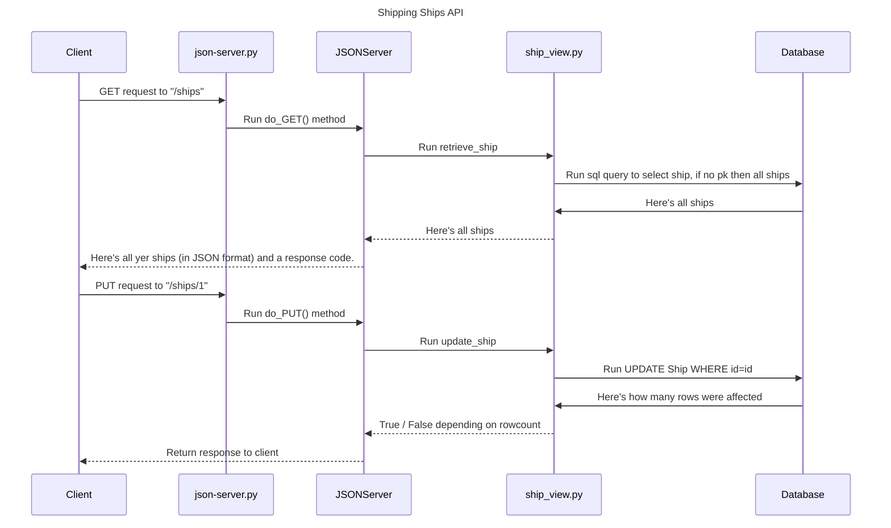

```mermaid
sequenceDiagram
    title Shipping Ships API

    participant Client
    participant json-server.py
    participant JSONServer 
    participant ship_view.py
    participant Database
    Client->>json-server.py:GET request to "/ships"
    json-server.py->>JSONServer:Run do_GET() method
    JSONServer->>ship_view.py:Run retrieve_ship
    ship_view.py->>Database:Run sql query to select ship, if no pk then all ships
    Database->>ship_view.py:Here's all ships
    ship_view.py-->>JSONServer: Here's all ships
    JSONServer-->>Client: Here's all yer ships (in JSON format) and a response code.

    Client->>json-server.py:PUT request to "/ships/1"
    json-server.py->>JSONServer:Run do_PUT() method
    JSONServer->>ship_view.py:Run update_ship
    ship_view.py->>Database:Run UPDATE Ship WHERE id=id
    Database->>ship_view.py:Here's how many rows were affected
    ship_view.py-->>JSONServer: True / False depending on rowcount
    JSONServer-->>Client: Return response to client


```