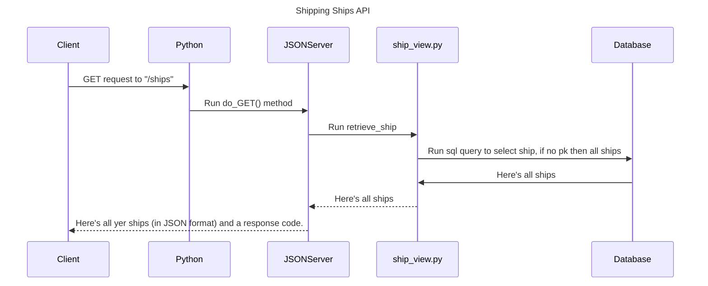

```mermaid
sequenceDiagram
    title Shipping Ships API

    participant Client
    participant Python
    participant JSONServer
    participant ship_view.py
    participant Database
    Client->>Python:GET request to "/ships"
    Python->>JSONServer:Run do_GET() method
    JSONServer->>ship_view.py:Run retrieve_ship
    ship_view.py->>Database:Run sql query to select ship, if no pk then all ships
    Database->>ship_view.py:Here's all ships
    ship_view.py-->>JSONServer: Here's all ships
    JSONServer-->>Client: Here's all yer ships (in JSON format) and a response code.

```